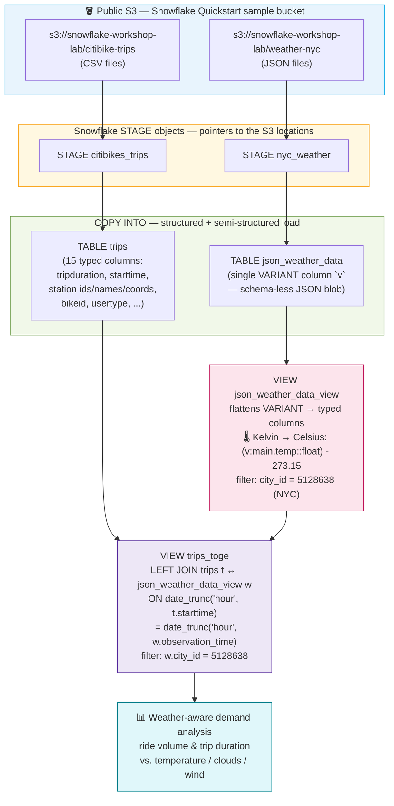
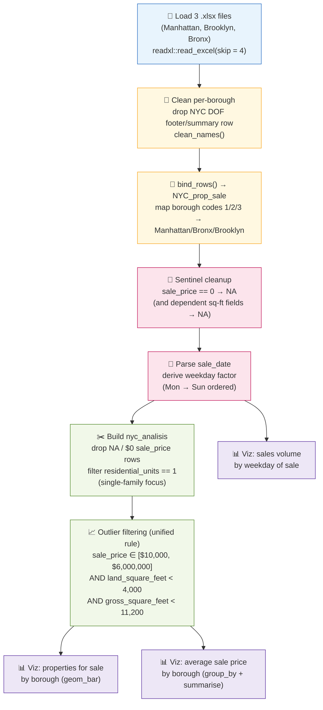
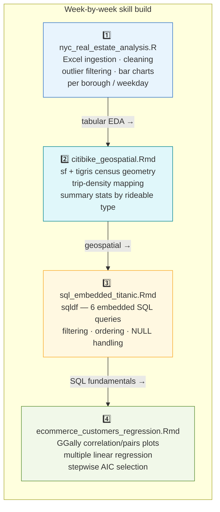

# 🏙️ NYC Real Estate & CitiBike Analytics — R + Snowflake Pipeline


Coursework from **Plataformas de Analítica de Negocios para Organizaciones (Gpo 101)**, semester 5 (S5), **Licenciatura en Inteligencia de Negocios (LIT)**, Tecnológico de Monterrey — Campus CSF (Aug–Dec 2024).

This repo bundles **four R-based exploratory data analysis scripts** built during the course, plus a **documented Snowflake data lakehouse pipeline** built as a team project. The code has been cleaned up from the original submitted drafts — bugs fixed, dead lines removed, deprecated syntax updated — so that it actually runs today, while `progression/` preserves two earlier, rawer drafts to show how the flagship script evolved.

---

## 📑 Table of contents

- [Academic context](#-academic-context)
- [Snowflake data lakehouse pipeline](#️-snowflake-data-lakehouse-pipeline)
- [NYC real estate analysis pipeline (R)](#-nyc-real-estate-analysis-pipeline-r)
- [Scripts included and how they relate](#-scripts-included-and-how-they-relate)
- [Bugs corregidos](#-bugs-corregidos)
- [How to run it](#️-how-to-run-it)
- [Repo structure](#-repo-structure)
- [Datasets and licensing](#-datasets-and-licensing)
- [Learning progression](#-learning-progression)
- [Team & credits](#-team--credits)

---

## 🎓 Academic context

| | |
|---|---|
| **Course** | Plataformas de Analítica de Negocios para Organizaciones (Gpo 101) |
| **Program** | Licenciatura en Inteligencia de Negocios (**LIT**) |
| **Institution** | Tecnológico de Monterrey — Campus CSF |
| **Semester** | S5, Aug–Dec 2024 |
| **Deliverables covered** | 4 individual R/R Markdown analyses + 1 team Snowflake pipeline ("Evidencia 1") |

---

## ❄️ Snowflake data lakehouse pipeline

`docs/snowflake_pipeline.md` documents a data lakehouse pipeline built **collaboratively as a team project** that joins NYC CitiBike trip data with NYC weather data inside Snowflake, to explore how weather conditions affect bike-share demand. There is no checked-in `.sql`/`.py` file — the team's original evidence was an 11-page PDF report, so the pipeline has been transcribed into readable Markdown + SQL for this repo.

> [!IMPORTANT]
> **The S3 buckets used in this pipeline are Snowflake's own public sample dataset, not data collected by the team.**
> `s3://snowflake-workshop-lab/citibike-trips` and `s3://snowflake-workshop-lab/weather-nyc` are the standard **"Snowflake Quickstart" / Zero to Snowflake** sample bucket that Snowflake uses in its own official onboarding tutorials. No credentials or private infrastructure are involved — the bucket is public/read-only, and is referenced here purely as the practice dataset the course exercise was built on top of.

### Architecture



**Key design points transcribed from `docs/snowflake_pipeline.md`:**

1. **`trips`** is loaded straight from CSV into a fully-typed 15-column table via `COPY INTO ... FILE_FORMAT = CSV`.
2. **`json_weather_data`** is loaded as a **single `VARIANT` column** (`v`) — the raw JSON stays schema-less at load time; all shaping happens downstream in a view (`ELT`, not `ETL`).
3. **`json_weather_data_view`** flattens the VARIANT with `v:path::type` accessors and does the **Kelvin → Celsius conversion inline** (`(v:main.temp::float) - 273.15`), filtered to `city_id = 5128638` (New York City).
4. **`trips_toge`** performs the **temporal join**: both `starttime` and `observation_time` are truncated to the hour with `date_trunc('hour', ...)`, since weather is observed hourly but trips happen continuously — a 1 weather-observation → N trips relationship.
5. The final view supports the team's business question: *does ridership drop in cold/rainy weather, and do trips run longer on clear days?*

---

## 🏠 NYC real estate analysis pipeline (R)

`r_scripts/nyc_real_estate_analysis.R` is an individual EDA pipeline over NYC Department of Finance "Rolling Sales" data for three boroughs.



The outlier-filtering step is the analytical core of the script: sale price is windowed based on a decile breakdown ($0/$1 "family transfer" sales at the bottom, a handful of extreme-price outliers at the top), and **both** square-footage fields must independently fall in a plausible range (`AND`, not `OR`) before a row is kept for the final comparison charts.

---

## 🧩 Scripts included and how they relate

The four deliverables form a rough progression through the course's data-analysis toolkit — from spreadsheet ingestion, to geospatial mapping, to embedded SQL, to statistical modeling.



| Script | What it does |
|---|---|
| **`nyc_real_estate_analysis.R`** | Loads the three NYC DOF "Rolling Sales" Excel files, combines and cleans them, maps borough codes to names, converts zero-price sales to `NA`, breaks sales down by weekday, filters outliers on price and square footage, and compares average sale price and listing volume across the three boroughs. |
| **`citibike_geospatial.Rmd`** | Cleans a month of CitiBike trip data (duration outlier filtering), computes summary stats per rideable type, and plots trip-start density over NYC using `sf` + `tigris` census block geometry. |
| **`sql_embedded_titanic.Rmd`** | Six SQL queries (via `sqldf`) run directly against the classic Titanic dataset inside an R Markdown report, covering filtering, ordering, and NULL handling. |
| **`ecommerce_customers_regression.Rmd`** | Exploratory correlation/pairs plots and a multiple linear regression (with stepwise AIC selection) predicting yearly customer spend from engagement metrics. |

---

## 🐛 Bugs corregidos

The original submitted scripts had several bugs typical of live, interactive RStudio console work that never got cleaned up before submission. Since the goal here is a portfolio piece a reader could actually run, these were fixed in `r_scripts/`:

| Bug original | Corrección aplicada | Archivo |
|---|---|---|
| `readx1` (dígito "1", no letra "l") en `pacman::p_load()` | Corregido a `readxl` — el typo hacía fallar silenciosamente la carga del paquete real | `nyc_real_estate_analysis.R` |
| `apha` en `ggpairs(mapping = aes(...))` | Corregido a `alpha` — el parámetro de transparencia se ignoraba silenciosamente | `ecommerce_customers_regression.Rmd` |
| Líneas muertas/rotas de exploración interactiva (`adsdads %>% filter(NYC_prop_sale)`, referencias a `nyc_analisis` antes de crearse, pipe incompleto, literal suelto `2`) | Eliminadas | `nyc_real_estate_analysis.R` |
| `land_square_fest` (typo) | Corregido a `land_square_feet` | `nyc_real_estate_analysis.R` |
| Umbral de outliers inconsistente — `OR` entre dos campos de metraje + un corte de precio razonado por separado | Unificado en una sola regla explícita: `sale_price` en [$10,000–$6,000,000] **y** ambos campos de metraje dentro de su rango plausible (`AND`, no `OR`) | `nyc_real_estate_analysis.R` |
| `dev.off` sin paréntesis (nunca cerraba el dispositivo gráfico) | Corregido a `dev.off()` | `citibike_geospatial.Rmd` |
| Sintaxis deprecada `aes(fill = ..count..)` / `..x..` de ggplot2 | Actualizada a `after_stat(count)` | `nyc_real_estate_analysis.R` |
| `aes(y = mean(sale_price))` — graficaba la misma altura en cada barra porque `mean()` se aplicaba a toda la columna, no por grupo | Corregido con `group_by()` + `summarise()` propio | `nyc_real_estate_analysis.R` |
| `library()` y `pacman::p_load()` duplicados | Consolidados en un único bloque de carga de paquetes | `nyc_real_estate_analysis.R` |

The `progression/` drafts are left **exactly as submitted, bugs included** — they document how the analysis evolved, not code meant to be run.

---

## ▶️ How to run it

```bash
# 1. Clone and open in RStudio (or run from the R console)
git clone <this-repo-url>
cd bsc-nyc-real-estate-snowflake-pipeline

# 2. Place source datasets locally (not checked into the repo — see below)
mkdir -p data/nyc_rolling_sales
# ...download the 3 NYC DOF Rolling Sales .xlsx files into data/nyc_rolling_sales/

# 3. Install dependencies (each script uses pacman::p_load at the top)
Rscript -e 'install.packages("pacman")'

# 4. Run the flagship script
Rscript r_scripts/nyc_real_estate_analysis.R

# 5. Knit the .Rmd reports in RStudio (Knit ▸ Knit to HTML), or:
Rscript -e 'rmarkdown::render("r_scripts/citibike_geospatial.Rmd")'
```

The Snowflake pipeline in `docs/snowflake_pipeline.md` is documentation only — there is no script to execute; the SQL blocks can be run directly in a Snowflake worksheet against the public Quickstart bucket referenced above.

---

## 📁 Repo structure

```
r_scripts/
  nyc_real_estate_analysis.R          # main script: NYC property sales EDA
  citibike_geospatial.Rmd             # CitiBike trip data + sf/tigris maps
  sql_embedded_titanic.Rmd            # embedded SQL (sqldf) queries over Titanic
  ecommerce_customers_regression.Rmd  # linear regression + stepwise selection
docs/
  snowflake_pipeline.md               # documented Snowflake data lakehouse pipeline
progression/
  2024_08_14_nyc_v1_draft.R           # first working draft of the NYC script
  2024_08_20_nyc_v2_draft.R           # second draft
```

---

## 🗂️ Datasets and licensing

Datasets are **not** checked into this repo (see `.gitignore`); scripts expect them under a local `data/` folder.

| Dataset | Used by | Source |
|---|---|---|
| NYC property sales ("Rolling Sales") | `nyc_real_estate_analysis.R` | [NYC Open Data / NYC Dept. of Finance](https://www.nyc.gov/site/finance/property/property-rolling-sales-data.page) |
| CitiBike trips | `citibike_geospatial.Rmd`, Snowflake pipeline | [CitiBike System Data](https://citibikenyc.com/system-data) (public monthly exports) |
| NYC weather (JSON) | Snowflake pipeline | Snowflake public **Quickstart** sample bucket (see callout above) |
| Titanic passengers | `sql_embedded_titanic.Rmd` | Standard open teaching dataset (Kaggle/Seaborn sample data) |
| Ecommerce Customers | `ecommerce_customers_regression.Rmd` | Synthetic teaching dataset commonly used in R regression tutorials |

---

## 🌱 Learning progression

The NYC real estate script went through **at least three dated iterations** during the course:

- `progression/2024_08_14_nyc_v1_draft.R` — first working draft: just get the files loading and combined.
- `progression/2024_08_20_nyc_v2_draft.R` — second draft: cleaning and early charts added.
- `r_scripts/nyc_real_estate_analysis.R` — cleaned-up **final (Aug 21) iteration**, with the most complete analysis: unified outlier filtering, per-borough comparisons, weekday-of-sale breakdown.

The two earlier drafts are kept under `progression/` **unmodified, as-submitted** (bugs and all), specifically to show the evolution from "just get the files loading" to the fuller, cleaned-up final analysis — evidence of real iteration, not a single polished snapshot.

---

## 👥 Team & credits

The Snowflake pipeline (data model + SQL) documented in `docs/snowflake_pipeline.md` was built collaboratively for a team course project ("Evidencia 1") by:

- **Gustavo Adolfo Santana Torrellas**
- **Gabriela Yáñez Martínez**
- **Jose Reyes Eslava Zavaleta**
- **Ludovic Delot Bravo** (A01663977)

The R scripts in `r_scripts/` are Ludovic's individual coursework from the same class, done separately from the Snowflake team project.

## 📦 Requirements

R (tested conceptually against packages current as of 2024–2025):
`dplyr`, `tidyverse`, `magrittr`, `RColorBrewer`, `readxl`, `janitor`,
`lubridate`, `formattable`, `DT`, `outliers`, `gridExtra`, `scales`, `sf`,
`tigris`, `rnaturalearth`, `rnaturalearthdata`, `hms`, `sqldf`, `GGally`,
`MASS`. Installed most easily via `pacman::p_load(...)`, which each script
uses at the top.
